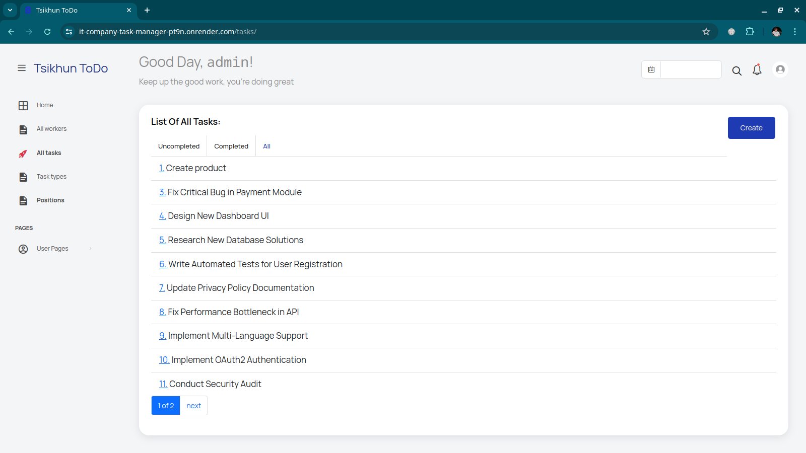

# IT Company Task Manager (https://it-company-task-manager-pt9n.onrender.com/)

So, I decided to implement my own Task Manager, which will handle all 
    possible problems during product development in my team. 
    Everyone from the team can create tasks, assign these tasks to team members,
    and mark the tasks as done.

## Table of Contents

- [Installation](#installation)
- [Technologies Used](#technologies-used)
- [DB Structure](#db-structure)
- [Page examples](#page-examples)

## Installation

```shell
git clone https://github.com/AlexTsikhun/it-company-task-manager
cd it-company-task-manager
python3 -m venv .venv
pip install -r requirements.txt
python3 manage.py makemigations
python3 manage.py migate
python3 manage.py runserver

```

Credentials:

Username: `test`
Password: ```rA$`3?590#<>```

## Technologies Used

- Django
- Sqlite3
- HTML (Jinja)/CSS/Javascript
- Bootstrap
- django-admin-star library
- dj-database-url

## DB Structure:


## Page examples





<details style="border: 1px solid #ccc; padding: 10px; margin-bottom: 10px">
<summary style="font-size: 1.17em; font-weight: bold;">Ideas to add:</summary>

- For each worker it is shown separately: completed and not completed tasks.
- Add Tags (like landing-page-layout or python-refactoring) for tasks with Many-to-Many relationship.
- Add support for Projects and Teams, different teams can work on different projects, and also inside projects there are a lot of tasks to do (complicated).
- total visitors counter
- add search (for all sections??)
- 
</details>

<details style="border: 1px solid #ccc; padding: 10px; margin-bottom: 10px">
<summary style="font-size: 1.17em; font-weight: bold; ">toDo</summary>

- add which worker should do this task/ or has this position
- my task
- future work - add alternative solution (client side with JS) for completed/uncompleted tasks
- when in `all`, btn should be unactive, show selected tab in tasks
- add checkbox for tasks in the main task-list page (and save with js??)
- placeholder to fields in forms
- bigger font size?
- title
- json file with data 
- add tests
- in profile tab, if haven't email or name info - write it
- if in index todo not tasks - show it
- when create - show also position, not only username
- when register add position
- if I will have a lot of Assignees? should be displayed beautifully
- in index page add request

</details>

